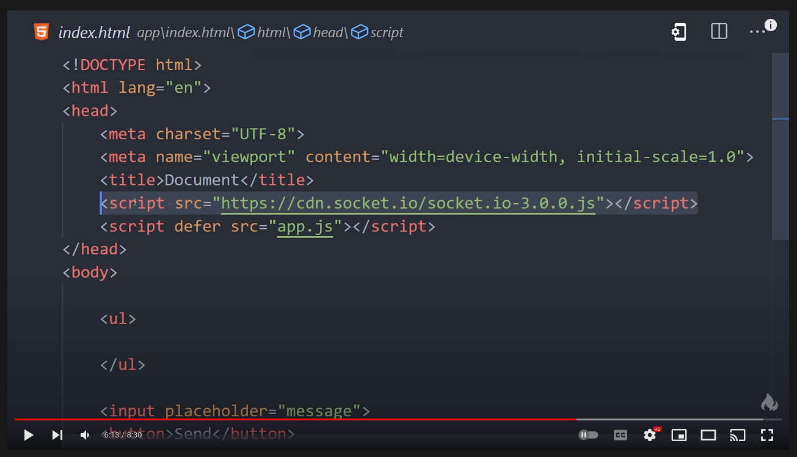

# Readme

Source: [WebSockets in 100 Seconds & Beyond with Socket.io](https://youtu.be/1BfCnjr_Vjg)

```bash
npm i socket.io
```

**FYI:**

- To use `socket.io` from frontend we need have cdn link or just install in react project(i.e., unlinke `WebSocket` `socket.io` is not a builtin in browser).



- **Code Structure i.e., `express` + `socket.io` from official docs: https://socket.io/get-started/chat**

- **Dealing Auth with socket.io:** https://stackoverflow.com/a/13940399/10012446

- **Store data associated to the socket using Socket.io:**

  - https://github.com/socketio/socket.io/issues/1651 : tldr; Advises to use your own data store and use `socket.id` to maintain uniqueness.
  - https://stackoverflow.com/a/29934170/10012446: tldr: Advises to use your own data store and use `socket.id` to maintain uniqueness.
  - Save data on socket: https://stackoverflow.com/questions/15876616/save-data-on-socket-in-socket-io ; tldr: NO CONCLUSION.

- **TODO: URGENT: Using namespaces in `socket.io`:**

  - Plese read this page fully: https://socket.io/docs/v4/
  - https://socket.io/docs/v4/#multiplexing
  - https://socket.io/docs/v3/namespaces/#Main-namespace

  ```js
  // src: https://socket.io/docs/v3/server-instance/#serverengine
  const count = io.engine.clientsCount
  // may or may not be similar to the count of Socket instances in the main namespace, depending on your usage
  const count2 = io.of('/').sockets.size
  ```

- **TODO: Official chat application example repo from `socket.io` example:**
  - https://socket.io/get-started/chat @ https://github.com/socketio/chat-example.git
